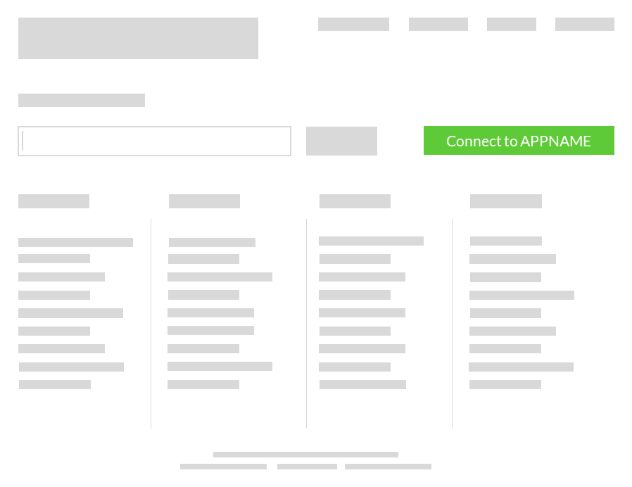

To enable your users to add an integration, simply present a “Connect” button or link within your application’s UI.

For example:

When a user clicks the “Connect” button, your application server should make a request towards Cyclr’s REST API’s _/users/launch_ method:


curl -X POST \\
\-H "Authorization: Bearer ${ACCESS\_TOKEN}" \\
\-H "Content-Type: application/json" \\
\-H "Accept: application/json"

\-d '{ \\
 "Username": "user@example.com", \\ 
 "Password": "password", \\ 
 "AccountId": "7047269e-9d36-4918-b28a-2f7b1100e998", \\ 
 "partnerConnector": {

 "Name": "Connector Name", \\

 "Version": "1.0", \\

 "AuthValue": "NJ88GGgv79V79VvYFBBTHUIGYBGY3434345545UYu", \\

 "Properties": \[

 {"Name": "Url", "Value": "[https://myapp.something.blah](https://myapp.something.blah)"}

 \] \\

 }
}' \\
"https://api.cyclr.com/v1.0/users/launch"


You should use a Cyclr Partner OAuth token as the Bearer token in this request.

Request parameters

Description

Example

Username

The name of the Cyclr account (and Cycrl user) to install this integration in, or to create if such an account (and user) does not already exist.

user@example.com

Password

The password to assign to the new Cyclr user account, if created.  
  
If you do not intend your end users to access the Cyclr application directly, this password can be an obscure value known only to your app.

ghjG87g8G8iUg8gGgouk

AccountId

If your user already has an account within Cyclr, specify the Id of that account to have the new integration installed there rather than a new Cyclr account.

7047269e-9d36-4918-b28a-2f7b1100e998

partnerConnector

(Optional) Providing the platform connector object here means your user will not be expected to authenticate against your own platform during the Launch flow.

{}

partnerConnector.Name

A name you wish to give this instance of your connector installed within this new or existing account.

Connector Name

partnerConnector.Version

The version of the partner connector to be installed.

1.0

partnerConnector.AuthValue

(Optional) Authentication value for your platform connector.  
  
If your platform users a username  
and password, provide as base64 encoded version of username:password  
  
Provide API keys as plain text.  
  
An OAuth token may also be provided here.

dXNlcm5hbWU6cGFzc3dvcmQ=  
  
or  
  
NJ88GGgv79V79VvYFBBTHUIGYBGY3434345545UYu  
  
or  
  
NJ88GGgv79V79VvYFBBTHUIGYBGY3434345545UYu

partnerConnector.Properties\[\]

An array of properties required by the partner connector for successful installation.  
  
This is not relevant to all connectors.

\[  
{"Name": "Url", "Value": "http://customDomain.appName.com"}  
\]

RunOnce

(Optional) Set it to true if the cycle to be launched should only be run once

true

Tags

(Optional) An array of tags that a cycle must have at least one of to appear in launch

\["CRM", "Email"\]

InlineOAuth

(Optional) Set it to false if you are running LAUNCH in an iFrame and wants OAuth redirect pages to be opened in a popup

false

Response:


{
"AccountId": "7047269e-9d36-4918-b28a-2f7b1100e998", "ExpiresAtUtc": "17/01/2018 12:11:22",
"LaunchUrl": "https://hostapp.cyclr.com/account/signinwithtoken?token=lld3UjpZKkuh0I7ObHR0EtxRsPo0No1GqNSyAi8pqXQ%3D&returnUrl=%2Flaunch",
"Token": "lld3UjpZKkuh0I7ObHR0EtxRsPo0No1GqNSyAi8pqXQ="
}


Response fields

Description

Example

AccountId

The ID of the newly created account or the existing account you provided in your request

42996545-aafe-4404-bb61-25b4527fcab1

ExpiresAtUtc

Token expiry timestamp

17/01/2018 12:11:22

LaunchUrl

The URL that your user should be sent to, typically opened in a popup browser window.  
  
Once generated by Cyclr, this URL will be valid for 5-minutes only and for a single request only, so you user should be passed here immediately and one time only.

https://hostapp.cyclr.com/account/signinwithtoken?token=lld3UjpZKkuh0I7ObHR0EtxRsPo0No1GqNSyAi8pqXQ%3D&returnUrl=%2Flaunch

Token

Launch URL token

lld3UjpZKkuh0I7ObHR0EtxRsPo0No1GqNSyAi8pqXQ=

[How to Handle Callbacks](./handling-callback)