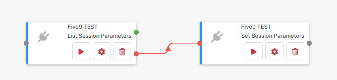

{::options parse_block_html="true" /}

<section class="card">
  
## Managing sessions

The Five9 connector needs a session to be active for you to make requests to the API. This session is a connection between Cyclr and the Five9 API. You can only have one active session per account. The session times out if you don't make a request to the API within a specified time period.

### Create a session

Create a session by using the **Sessions** > **Set Session Parameters** method. The **Rolling Period** and **Statistics Range** parameters define how statistics are returned from the API for requests in the session. The time out duration is defined by the **Idle Time Out** parameter, this will default to `180` seconds if not set.

If a session is already active when this method is called, the already active session updates with a new session with the set parameters. If no session is active when this method is called, a new session starts.

### Check session status

Check the status of a session by using the **Sessions** > **List Session Parameters** method. When placed in a cycle, this method has true/false exits that reflect the status of the current session:

*  If there is an active session, the method returns the session parameters and exits through the true exit.
*  If there is no active session, the method exits through the false exit.

### Maintain a session

To permanently maintain an active session using a cycle:

1. Create a cycle with the following Five9 methods from the **Sessions** category: 
2. In the cycle, select **Step Setup** for the **Set Session Parameters** method.
3. Set any required parameters and set the **Idle Time Out** parameter to `1800`.
4. Select **Close**.
5. Select **Run** > **Repeat**.
6. Set **Run this cycle every** to `15 minutes`.
7. Select **Run Now**.

</section>
